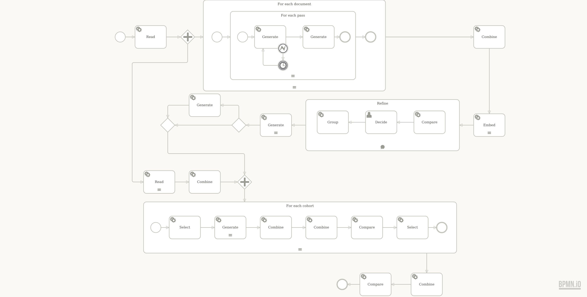

# Analysis pipeline as BPMN

An analysis pipeline — documents in, findings out — drawn as a BPMN process
built from eight primitives.

[**Live demo**](https://teekuningas.github.io/bpmn-analysis-pipeline/)



## Vocabulary

| | |
| --- | --- |
| Read | — → collection |
| Select | collection → collection |
| Generate | text → text |
| Embed | text → vector |
| Compare | collection → matrix |
| Group | matrix, number → groups |
| Combine | collection[] → collection |
| Decide | matrix → number |

That is all of it. Everything else is arrangement, and BPMN supplies the
combinators: a multi-instance marker is `map`, a gateway is `filter`, a
collecting loop is `fold`, a fork and join is parallelism.

So `Generate` appears six times — drafting, structuring, naming a group,
translating, scoring a document — and means something different each time
because of where it sits. `Compare` measures similarity between embeddings in
one place and association between columns in another.

The shape carries the method: passes repeated per document, a retry that backs
off and tries again, a refinement loop around a human judgement, an optional
step that rejoins, two cohorts analysed the same way and contrasted at the end.

## Running it

```sh
python3 -m http.server 8000    # ES modules need http, not file://
```

## Layout

```
workflows/pipeline.bpmn   the process, editable in any BPMN modeller
app/primitives.js         the vocabulary
app/engine.js             BPMN interpreter
app/ui.js                 diagram and playback
```

## Limits

Primitives are signatures and durations, not implementations: the demo plays the
process at realistic speed rather than computing anything. There is no data in
this repository.

The engine covers the elements this diagram uses and nothing else. For real work
use [SpiffWorkflow](https://github.com/sartography/SpiffWorkflow),
[bpmn-engine](https://github.com/paed01/bpmn-engine), or Camunda. The service
tasks follow SpiffWorkflow's `spiff:serviceTaskOperator` convention.
